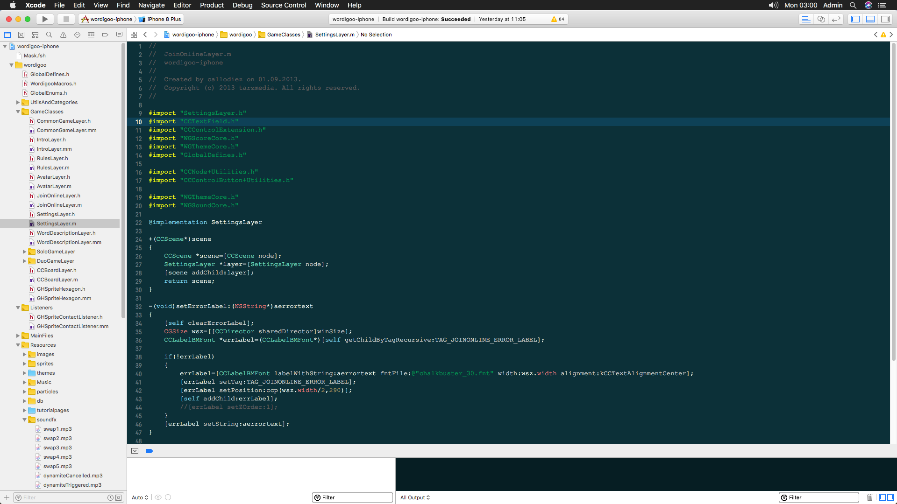
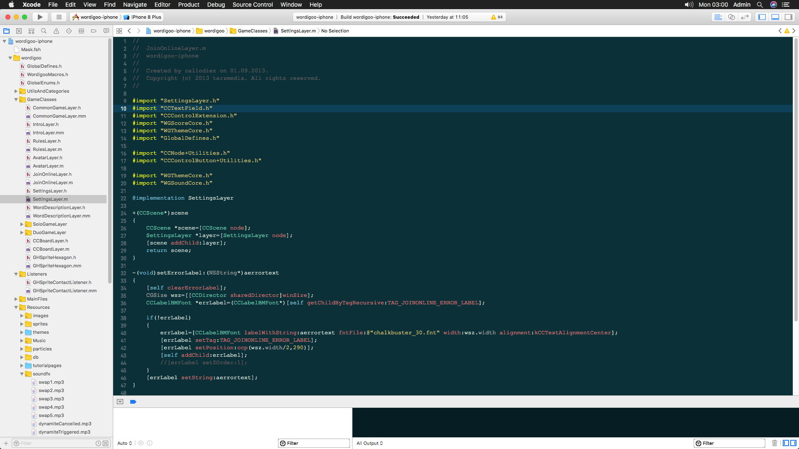
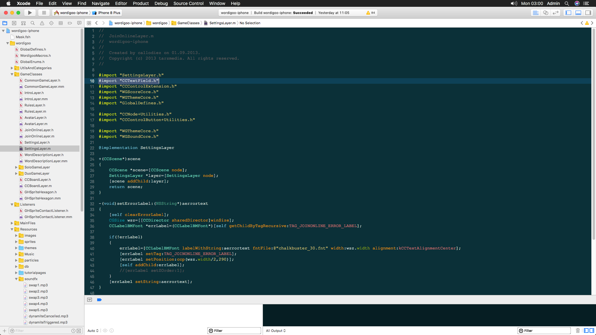
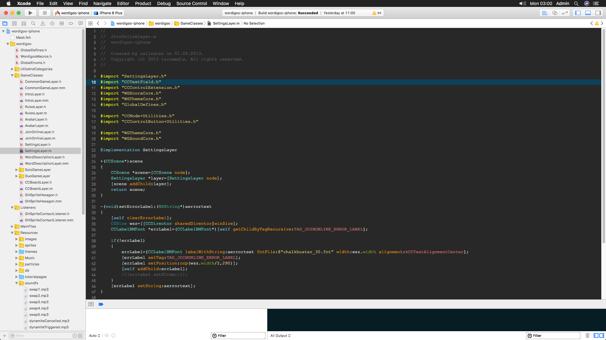

Xcode-themes
============

Collection of my favorite custom color themes for Xcode.

To install: 

1. Download and copy the themes you want to Xcode's FontAndColorThemes folder located at (~/Library/Developer/Xcode/UserData/FontAndColorThemes/).

2. Restart Xcode.

3. Go to Xcode preferences and edit color theme selection

---

Pastel Nights California:

Pastel Nights California 1:

Pastel Nights California 2:

Pastel Nights California 3:

